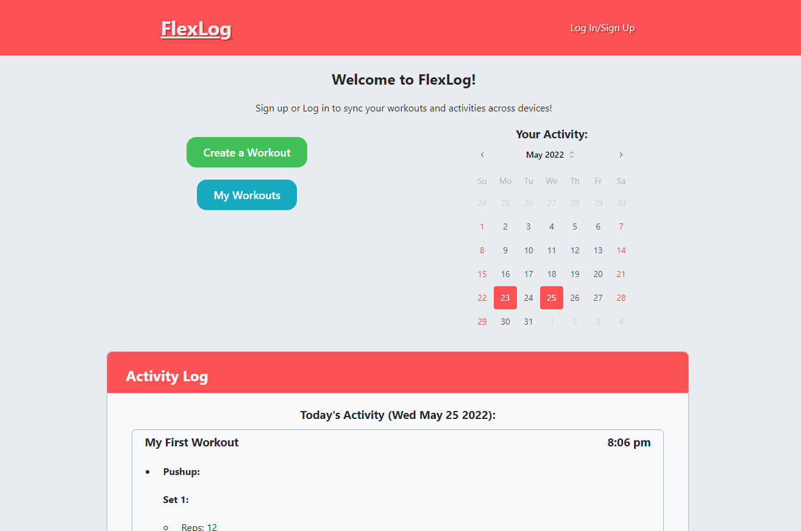

# FlexLog

## About the Project

FlexLog is a fitness PWA that allows users to create, follow, and track their workout activity.

### Features

- Installable and mobile-friendly - for on-the-go or at-home!
- Offline functionality - no need for an internet connection!
- Sync your workouts across devices by making an account!

### Future development

- Share & Save workouts with the FlexPlorer!
- Rest timers between sets
- Custom Exercise icons

[Click here to check out the deployed application!](https://shielded-stream-03290.herokuapp.com/)

## Table of Contents

- [Examples of Use](#examples-of-use)
- [Contributions](#contributions)
- [License Information](#license-information)
- [Contact](#contact)

## Examples of Use

- Create a workout using the "Create Workout" button
  - Enter title, description, and categories for the workout
  - Add exercises, and enter data for exercises.
  - Reps, Weight, and Distance are conditional; if they apply to the exercise, select them. Otherwise you can leave them blank and they won't appear while you're following the workout
  - Timer has two types: Countdown (for planks, HIIT, etc.) and Stopwatch (for Running, Walking, anything without a set time limit).
- Visit the "My Workouts" page to pick a workout to Start/Edit/Delete
- Once a workout is started, input your activity for each set
  - When the workout is completed, it will appear on your Activity Log on the home page

## Contributions

- William Ingram

  - React.js
  - Mantine Component Library
  - Misc. Frontend & Design

- John Maclellan
  - MongoDB
  - GraphQL & Apollo Server
  - Express

## License Information

Copyright (c) by William Ingram & John Maclellan, 2022

Licensed under the [MIT](https://opensource.org/licenses/MIT) license.

## Contact

William Ingram

- GitHub: wingram1
- Email: waingram96@gmail.com

John Maclellan

- GitHub:
- Email:
